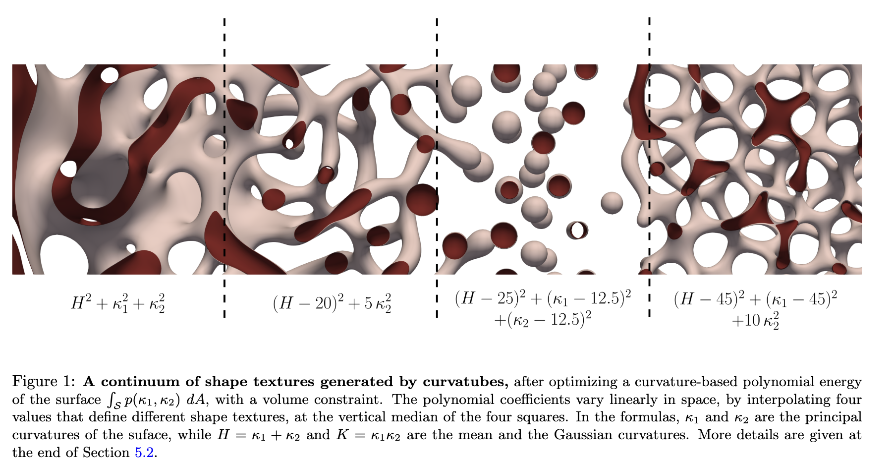

# 3D_BioShape
This project is part of an MVA course at ENS. We are reviewing the paper of Dr. Song (https://arxiv.org/abs/2103.04856), who is interested, both theoretically and practically, in the generation of 3D shapes of different topologies using topological data analysis. 
Firugre from: [Song's article](https://arxiv.org/abs/2103.04856)

